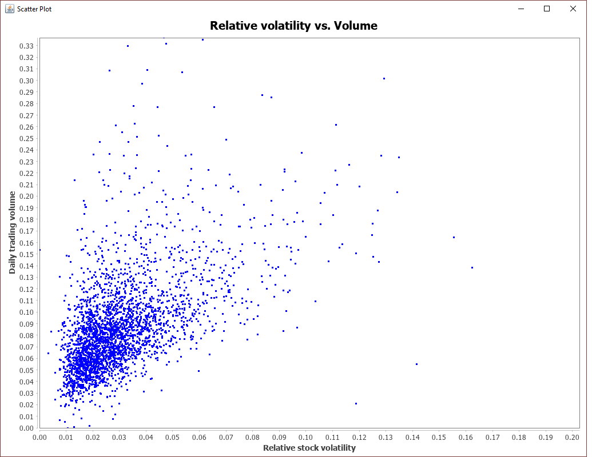

# Scala for Machine Learning

Nothing much to see here. This repository contains my work (learn by doing) for Patrick Nicolas' book Scala for Machine Learning.

https://www.amazon.com/Scala-Machine-Learning-Patrick-Nicolas/dp/1783558741

I **stopped** working on the exercises in the book for reasons outlined in my book review:

The book served me as an adequate reference on the beginning of my journey to learn machine learning. At the time, I was using Spark. The code examples in that context of Spark are not useful. Later (once there was no time crunch), I decided that it might be helpful to work through the book's code snippet.

My observation is that the code examples in the book serve only to document the accompanying GitHub repository. Most of the effort working through the examples was spent trying to understand the book's framework and nomenclature (:/ is foldLeft, DblArray, ...), not to mention the painstaking process of deciphering functional code snippets. Don't get me wrong, I enjoy writing (and the challenge of reading) functional code, but I do not believe that this coding style is an appropriate paradigm for a book supposedly written to help the reader learn machine learning.

